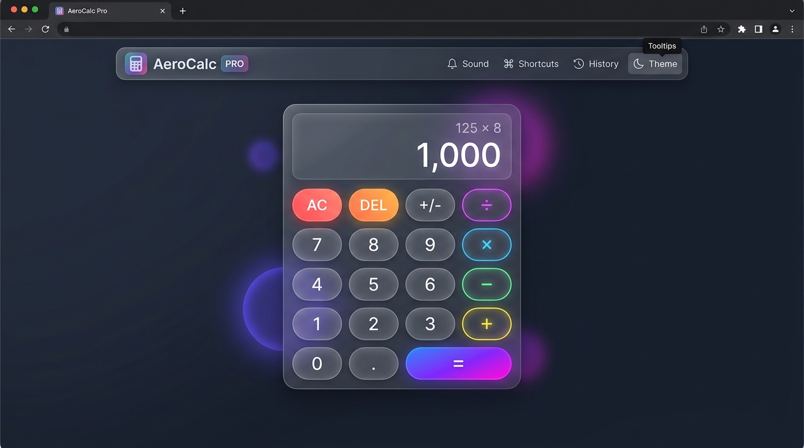

# AeroCalc Pro — Modern JavaScript Calculator ⚡

[](./index.html)
[](https://developer.mozilla.org/en-US/docs/Web/HTML)
[](https://developer.mozilla.org/en-US/docs/Web/CSS)
[](https://developer.mozilla.org/en-US/docs/Web/JavaScript)
[](https://opensource.org/licenses/MIT)

> A modern, professional, fully responsive web calculator built from scratch using **HTML5, CSS3, and Vanilla JavaScript (ES6+)**. Designed with high-end glassmorphism aesthetics, fluid micro-interactions, robust floating-point error handling, calculation history, audio feedback, and full keyboard navigation.

---

## 📸 Preview & UI Design



---

## ✨ Features

### 🧮 Core Calculator Operations
* **Basic Arithmetic:** Addition (`+`), Subtraction (`−`), Multiplication (`×`), and Division (`÷`).
* **Decimal Operations:** High-precision decimal calculation with multi-decimal point collision prevention.
* **Percentage Calculation:** Context-aware percentage handling (`%`), supporting both relative increments (`100 + 10% = 110`) and standalone proportions (`50% = 0.5`).
* **Sign Inversion:** Instant positive/negative toggle (`±`).
* **Backspace & All Clear:** Single-character deletion (`DEL`) and full state reset (`AC`).
* **Sequential & Chained Calculations:** Supports chaining expressions (e.g. `12 + 4 × 2`) with intermediate result computation.
* **Consecutive Operator Replacement:** Seamlessly swaps active operators without resetting inputs if the user changes their mind.
* **Safe Error Handling:** Graceful division by zero protection (`Cannot divide by 0`) without application crashes.
* **Precision Math:** Eliminates IEEE-754 floating-point inaccuracies (e.g. `0.1 + 0.2 = 0.3`).

### 🎨 Modern Glassmorphism & UX
* **Glassmorphism Aesthetic:** Multi-layer backdrop blur, ultra-thin border highlights, dynamic ambient glow orbs.
* **Dark & Light Mode:** Toggleable color themes persisted across browser reloads via `localStorage`.
* **Dynamic Typography:** Auto-shrinking display numerals that adapt as expressions grow longer, preventing overflow.
* **Formatted Readout:** Automatic thousand-separator comma formatting (e.g., `1,250,000.75`).
* **Interactive Micro-Animations:** Haptic spring-press feedback, hover elevations, and operator highlight glows.
* **Sound Feedback (Haptic Web Audio API):** Synthesized zero-latency audio clicks using the browser's native Audio Context, with mute/unmute control.
* **One-Click Copy:** Fast clipboard copying with animated feedback toasts.

### 📜 Calculation History
* **Persistent History Log:** Saves up to 30 past equations and results in `localStorage`.
* **Slide-out Drawer:** Smooth animated sliding history panel with item counter badge.
* **Click-to-Recall:** Click any previous calculation to restore its result directly into the active display.
* **Clear History:** One-click instant history purging.

### ⌨️ Comprehensive Keyboard Navigation
| Key | Action |
|:---:|:---|
| <kbd>0</kbd> – <kbd>9</kbd> | Number input |
| <kbd>.</kbd> or <kbd>,</kbd> | Decimal point |
| <kbd>+</kbd> <kbd>-</kbd> <kbd>*</kbd> <kbd>/</kbd> | Basic operations |
| <kbd>Enter</kbd> or <kbd>=</kbd> | Compute result |
| <kbd>Backspace</kbd> | Delete character (DEL) |
| <kbd>Escape</kbd> or <kbd>c</kbd> | Clear all (AC) |
| <kbd>%</kbd> | Percentage |
| <kbd>Ctrl</kbd> + <kbd>C</kbd> | Copy result to clipboard |
| <kbd>h</kbd> | Toggle history drawer |
| <kbd>?</kbd> | Toggle keyboard shortcuts modal |

---

## 🧠 JavaScript Concepts Practiced

This project purposefully uses **100% Vanilla JavaScript (ES6+)** with zero external frameworks to master fundamentals:

- **ES6+ Modern Syntax:** Block-scoped declarations (`const`, `let`), arrow functions, template literals, default function parameters, and destructuring.
- **Object-Oriented Programming (OOP):** Encapsulated `Calculator` ES6 class cleanly separating calculation state from UI rendering.
- **DOM Traversal & Manipulation:** `document.querySelector()`, `document.querySelectorAll()`, dynamic class modification (`classList.add`, `classList.remove`, `classList.toggle`), and programmatic element creation.
- **Event-Driven Architecture:** `addEventListener` for `click`, `keydown`, `DOMContentLoaded`, and delegation patterns.
- **State Machine Management:** Tracking `currentOperand`, `previousOperand`, `operation`, `shouldResetScreen`, and `hasError`.
- **Safe Floating-Point Normalization:** Controlled rounding algorithms avoiding `eval()` security liabilities.
- **Web Storage API:** Local storage serialization (`JSON.stringify()`, `JSON.parse()`) for theme preference and history logs.
- **Web Audio API:** Creating synthetic oscillator tones (`OscillatorNode`, `GainNode`) for tactile feedback without audio files.
- **Async Clipboard API:** `navigator.clipboard.writeText()` with fallback support for broader compatibility.

---

## 📁 Project Structure

```text
Calculator/
├── index.html                 # Semantic HTML5 markup & accessibility structure
├── style.css                  # Direct CSS root entry
├── script.js                 # Direct JS root entry
│
├── css/
│   └── style.css             # Glassmorphism design system & responsive rules
│
├── js/
│   └── script.js             # OOP Vanilla JavaScript calculator engine
│
├── assets/
│   ├── icons/
│   │   └── calculator-icon.svg  # High-res SVG vector app icon
│   └── images/
│
├── screenshots/
│   └── calculator.png        # High-fidelity application preview mockup
│
└── README.md                  # Comprehensive project documentation
```

---

## 🚀 How to Run the Project

No build step or dependencies required!

### Option 1: Direct File Launch
Simply double-click [`index.html`](./index.html) in your file explorer to open it in any modern browser (Chrome, Edge, Firefox, Safari).

### Option 2: Local Development Server
For the best experience (and to test clipboard permissions), run a lightweight HTTP server:

```bash
# Using VS Code Live Server extension:
# Right-click index.html -> "Open with Live Server"

# Or using Python 3:
python -m http.server 8000

# Or using Node.js npx:
npx serve .
```

Then visit `http://localhost:8000` in your browser.

---

## 🔮 Future Improvements

- [ ] Scientific mode (trigonometry: `sin`, `cos`, `tan`, logarithms, square root `√`, powers `x^y`).
- [ ] Unit conversion tools (currency, length, temperature).
- [ ] Mathematical expression formula bar parser with parentheses support `( )`.
- [ ] Export calculation history to CSV / TXT.

---

## 📄 License

This project is licensed under the [MIT License](https://opensource.org/licenses/MIT). Created as part of the **50 Project Challenge** by [Rashid Ayub](https://github.com/RashidAyub).
